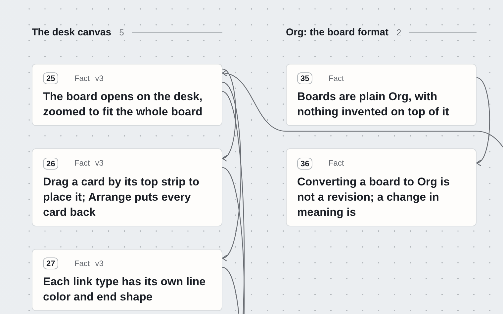

# card-skill

Your agent answers with cards. You judge each one.

A skill for coding agents (Claude Code, and any agent that loads a
`SKILL.md` folder). When an answer holds several things to judge, the agent
lays it out as a board: **one claim per card, at most one ask**. You mark,
choose and approve on one page. Your reply goes back as data, one line per
card.

<a href="https://lroolle.github.io/card-skill/"><picture><source media="(prefers-color-scheme: dark)" srcset="site/shots/design-review-dark.png"></picture></a>

**Try it in the browser: https://lroolle.github.io/card-skill/** A live
board waits there; answer it and press Send to see what the agent reads.
中文介绍： https://lroolle.github.io/card-skill/zh/

## The loop

The agent writes `board.org`, plain Org mode:

```org
** Pick NATS unless replay beyond 7 days matters
:PROPERTIES:
:CUSTOM_ID: pick-queue
:ASK: choose
:END:
NATS meets both needs at the lowest operating cost.

- [X] [[#nats]]
- [ ] [[#kafka]]
```

`cards render` turns it into one self-contained `board.html`. You open it,
answer, and send. The agent reads:

```
cards: reply from the board "Pick a queue for the ingest service" (demo)
rev 1 · 2026-10-09 12:46 · reply 53dcbab1

  #6 pick-queue   choose   changed: kafka  (you suggested nats)
  #7 cutover      approve  held: #6 changed from your suggestion; ...
  #3 nats         mark     more (go deeper)
```

Then it revises the board. A card that changed says so and keeps what it
said before.

## Install

```
git clone https://github.com/lroolle/card-skill
cp -R card-skill/skill ~/.claude/skills/card-skill
```

A real copy, not a link. The copy does not update itself: after a pull,
remove it and copy again. Node 18 or later; no dependencies.

Then ask for something that ends in a decision:

> Compare three queues for our ingest service and let me pick. Answer with cards.

The skill tells the agent when a board is earned and when prose is better.
Most answers should stay prose.

To see a board without an agent:

```
cd card-skill
node skill/bin/cards.mjs render design-review   # prints the file:// link
node skill/bin/cards.mjs serve                  # or: live boards at http://127.0.0.1:4747
```

## What a card gives you

- **One claim, at most one ask.** A card is the smallest thing you can judge
  and point at. "Card 12 is wrong" is a complete review comment.
- **Whose turn it is.** A yellow-red tab stands on each card that waits on
  you: Choose, Approve, Answer, or Do (a step only you can take). The
  browser tab counts them.
- **Versions.** A revised card is marked Changed and keeps its earlier
  versions. An answer you gave to an old version is flagged, not reused.
- **Asks that know their premise.** An approval that rests on a choice waits
  for the choice. Change the choice, and the approval is held until the
  agent asks again.
- **Evidence in the card.** A screenshot, lines 40 to 60 of a file, a
  drawing of a flow. They travel inside the one HTML file.
- **Two views.** The desk lays every card on a table and draws the links
  between them. The rack is a column for reading.
- **A list of boards.** `.cards/index.html` shows every board of a project
  and how many asks are open on each.
- **Plain Org underneath.** `board.org` is an outline that Emacs folds and
  GitHub renders. The tests run `org-lint` on every board.
- **Your language.** The buttons follow the board's language (English and
  Simplified Chinese ship), and a Chinese board carries its own font.

## Commands

`cards` is `node <skill>/bin/cards.mjs`.

| Command | What it does |
|---|---|
| `cards new <board> --pattern decide\|review\|plan\|brief\|status` | start from a working board |
| `cards check <board>` | validate; every error shows a corrected example |
| `cards render <board>` | record revisions, write `board.html` |
| `cards serve` | live boards on loopback; Send writes the reply to disk |
| `cards wait <board>` / `cards inbox` | read the reply |
| `cards ingest <board>` | record a reply the human pasted |
| `cards settle <board>` | mark the answered asks `DONE` |
| `cards ids <board>` | write an id for every card that has none |
| `cards say <board> "..."` | answer in the board's chat |
| `cards hook` | the lines for a Claude Code hook that hands the agent unread replies |
| `cards export <board> --out <dir>` | a copy to publish: no replies, no history, no local path |
| `cards shot <board>` | a picture of the page, where Playwright is installed |

The agent's instructions are [`skill/SKILL.md`](skill/SKILL.md). The format
is [`skill/reference/format.md`](skill/reference/format.md).

## How it differs from answer-me-with-html

[answer-me-with-html](https://github.com/QingYunA/answer-me-with-html)
showed that a skill can change the medium of an answer: the agent renders
one self-contained HTML page from a fixed set of components, the page has
asks and comment boxes, and a Reply button copies one message for you to
paste. This project took that loop as its starting point. The differences,
as we read that project in October 2026
([notes](docs/research/answer-me-with-html.md)):

| | answer-me-with-html | card-skill |
|---|---|---|
| Used for | answers in general | several judgments, a decision, work across turns |
| The agent writes | a page from components | `board.org`: plain Org that Emacs and GitHub read |
| The unit | a panel on a page | a card with a stable id, a numeral and versions |
| The reply names | the question text | the card, its version and the option's key |
| The reply travels | by copy and paste | to disk through a loopback server, or by paste and `cards ingest` |
| Asks that depend on asks | not modelled | wait, hold, or skip, and the reply says which |
| Many cards | a page | a desk that draws the links between cards |

Every design decision, with its reason and what was rejected, is in
[`docs/DECISIONS.md`](docs/DECISIONS.md); the notes on prior art are in
[`docs/research/`](docs/research/).

## Limits

- It is not for one answer. A board for one paragraph is costume.
- It is tested in Chromium, Firefox and WebKit on a desktop. Safari itself
  and a phone in a hand are not verified yet.
- It has no hosted service. A published board is a static page; a reader copies
  the reply and sends it to you.

The full list is [`docs/STATUS.md`](docs/STATUS.md). What comes next is a
board: [the roadmap](https://lroolle.github.io/card-skill/roadmap/).

## Repo

```
skill/                the installable skill
  SKILL.md            when to use a board, how to write one, the loop
  CHANGES.md          what each version changed, for the agent
  reference/          the format, and the writing profile (near ASD-STE100)
  bin/cards.mjs       the CLI
  lib/                parsers, lint, figures, files, the log, the compiler, the server
  runtime/            the page: board.html, board.css, board.js, digest.js, lang/
  templates/          five working boards: decide review plan brief status
test/                 node --test: the kernel, the loop, a real browser end to end
site/                 the landing page; scripts/site.mjs builds it with the boards
.cards/               boards the project shows: design-review, roadmap, demo, demo-zh
docs/                 STATUS, DECISIONS, research
DESIGN.md, TASTE.md   the visual material and its rulings
```

## Test

```
npm test
```

110 tests. The browser tests need Playwright and skip without it; three
tests need Emacs (they run `org-lint` on the boards) and skip without it.
On GitHub nothing skips: the suite runs in Chromium, Firefox and WebKit
(`CARDS_BROWSER`), with Emacs and with the font tools.

## License

MIT. Two ideas came from others: Andrej Karpathy's notes on making model
output easier to judge, and
[answer-me-with-html](https://github.com/QingYunA/answer-me-with-html), which showed that a skill
can change the medium of an answer.
